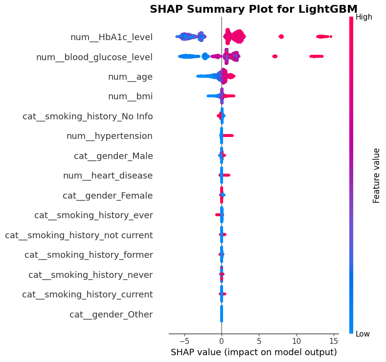

# SUGAR: Smart Utilization of Glucose & AI for Risk Prediction
A machine learning-powered tool designed for robust diabetes classification from patient datasets, aiming for web-server deployment.

The input dataset - https://www.kaggle.com/code/kashafabbas036/diabetes-dataset-preprocessing

**The Challenge: Precision in Diabetes Classification**
Accurate and early classification of diabetes is crucial for timely intervention and improved patient outcomes. Existing methods often struggle with optimal predictive performance and accessibility for non-technical users.

**Solution: SUGAR**
This project introduces SUGAR (Smart Utilization of Glucose & AI for Risk prediction), a machine learning tool built to enhance the precision of diabetes classification. Leveraging the comprehensive Kaggle Diabetes Prediction Dataset, SUGAR develops and evaluates advanced predictive models. Our primary goal is to identify the most effective classification model, with the ultimate aim of deploying it via a user-friendly web server to make accurate diabetes risk prediction readily accessible.

### Initial data exploration
The first step is to explore the dataset to understand its structure, identify key features, and uncover initial patterns or anomalies.

Followed by looking into distribution of blood glucose level across genders

Based on the dataset, further explored the key features that have an imapct in diabetes prediction

In the above heatmap, **HbA1c_level (40%)*** and ***blood_glucose_level (42%)*** exhibit a significant positive correlation with diabetes. This strong relationship is medically consistent: higher values in these crucial blood markers directly indicate a greater probability of diabetes.

The same can be seen in the shap plot

The most impactful features are clearly ***num_HbA1c_level*** and ***num_blood_glucose_level***, followed by num_age and num_bmi. A consistent trend observed is that higher values (red dots) in these top features strongly push the model towards predicting diabetes (positive SHAP values), while lower values (blue dots) decrease that likelihood. This directly aligns with medical understanding, confirming the model relies on diagnostically relevant indicators for robust and interpretable classifications.

### Model building
To built the model the dataset was split into training and testing

At this point it is clearly visible that there is class imbalance and to deal with it SMOTE was used and 
post SMOTE the training set looked like

Built multiple binary classifiers which are as follows with their recorded performance:-

Looking at the above it was clear that the lightGBM model with SMOTE performed the best followed by Gradient boosting with SMOTE which is close second in terms of overall performance

### Model Fine-Tuning: Optimizing LightGBM Performance

The updated parameters are as follows:-

The final resultant model has the following performance

